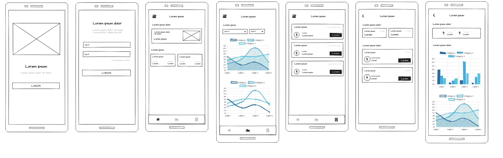
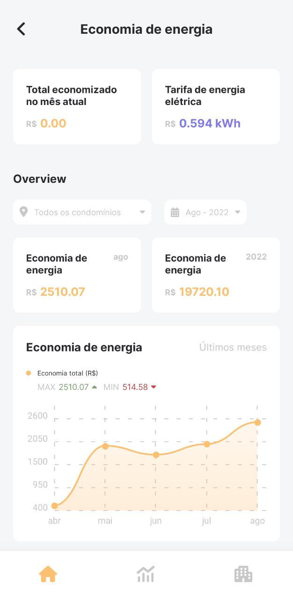
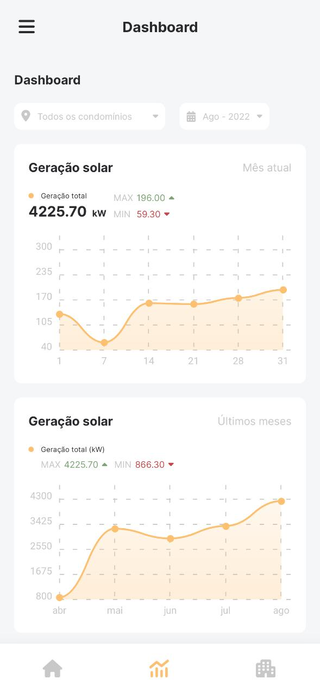
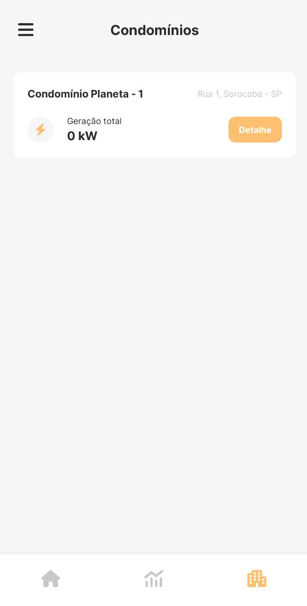
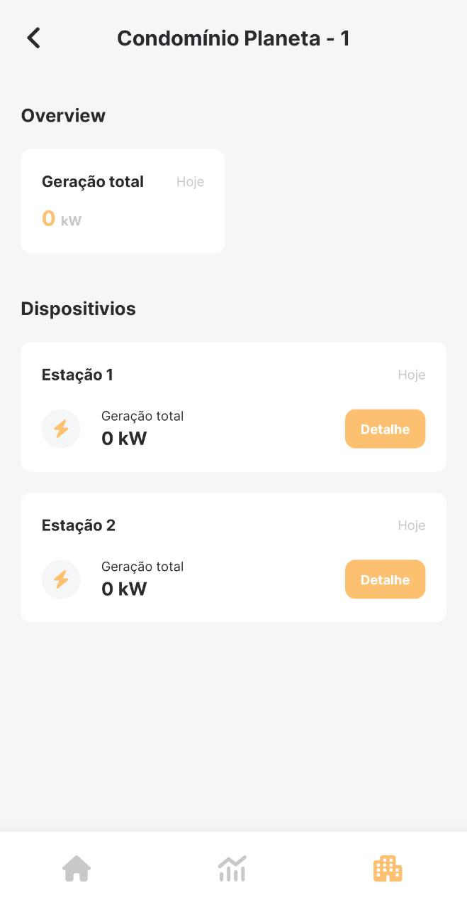
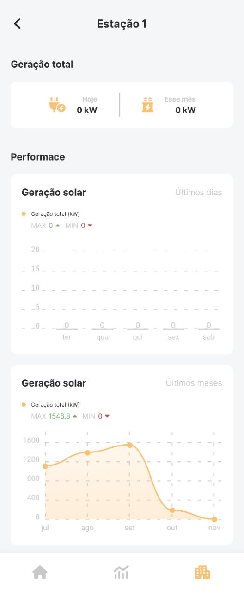
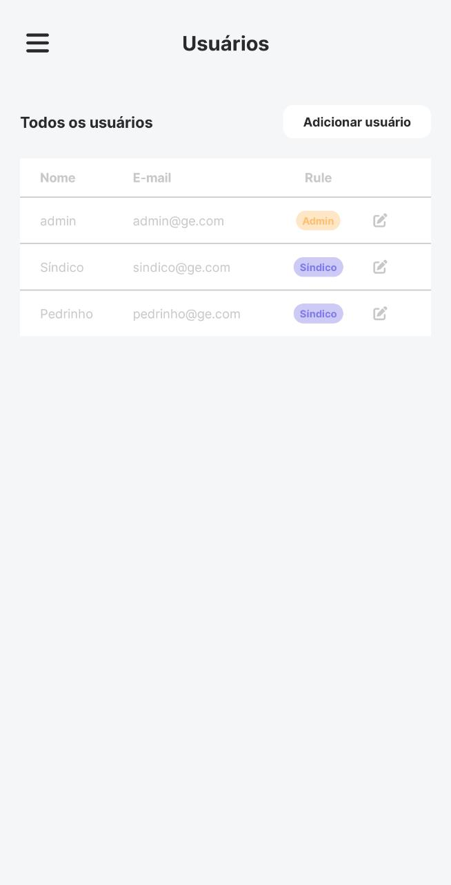
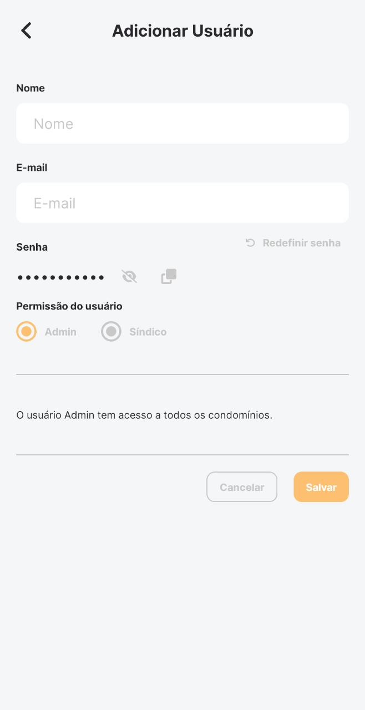

<br />
<p align="center">

  <h3 align="center">Grow Energy</h3>

  <p align="center">
    Integração e Exibição das Informações em Painéis Solares de Diferentes Condomínios
  </p>
</p>

<details open="open">
  <summary>Índice</summary>
    <ol>
    <li>
      <a href="#sobre-o-projeto">Sobre o projeto</a>
      <ul>
        <li><a href="#protótipo-de-baixa-fidelidade">Protótipo de baixa fidelidade</a></li>
        <li><a href="#construído-com">Construido com</a></li>
        <li><a href="#funcionalidades">Funcionalidades</a></li>
      </ul>
    </li>
    <li><a href="#grupo">Grupo</a></li>
  </ol>
</details>

## Sobre o projeto

App construído para auxiliar o gerenciamento de geração de energia solar, permitindo unir todas as suas estações de energia solar em um só lugar, dessa forma, facilitando o gerenciamento e proporcionando um controle dos dados através de um dashboard.

### Protótipo de baixa fidelidade

A imagem abaixo, representa nosso protótipo de baixa fidelidade.



### Protótipo de alta fidelidade

O nosso protótipo de alta fidelidade foi construído no [Figma](http://figma.com/).

- [Protótipo de alta fidelidade](https://www.figma.com/file/nDTYd4xtBrNfxowenXd45r/UPX6?node-id=0%3A1)

### Construído com

O projeto foi construído utilizando:

- [Expo](https://expo.dev/)
- [Firebase](https://firebase.google.com/)
- [TypeScript](https://www.typescriptlang.org)

### Funcionalidades

A primeira funcionalidade é as informações de economia de energia, onde é possível ver o total economizado com a geração de energia a cada mês.

<p align="center">
  
</p>

A segunda funcionalidade é o Dashboard onde apresenta um gráfico com as informações de geração solar durante o mês selecionado e um gráfico com a comparação das gerações dos últimos meses. No Dashboard tem a opção do usuário selecionar um determinado condomínio ou uma determinada data.

<p align="center">
  
</p>

A terceira funcionalidade é a opção de analisar cada condomínio separado e suas estações de geração solar, onde o usuário pode selecionar uma estação específica e ver sua geração dos últimos dias e dos últimos meses.

<p align="center">
  
  
  
</p>

A última funcionalidade está disponível apenas para os usuários admins onde possuem acesso a um CRUD de usuários, podendo adicionar novos ou editar os existentes. Na criação de um usuário pode ser criado como “admin”, e possuir acesso aos dados de todos os condomínios, ou pode ser criado como “síndico”, e possuir acesso apenas aos condôminos que lhe foram concebidos o acesso.

<p align="center">
  
  
</p>

## Como Usar

Para obter uma cópia local desse repositório, siga estas etapas.

### Pré-requisitos

- Firebase

  Esse projeto necessita da utilização do Firebase, pois utiliza as funcionalidades do Authentication, do Cloud Firestore e das Functions.

- yarn

  Baixe e instale a versão mais recente do [yarn](https://classic.yarnpkg.com/en/docs/install/).

  Instalar via npm

  ```sh
  npm install --global yarn
  ```

  Instalar via Chocolatey

  ```sh
  choco install yarn
  ```

### Instalação

1. Clone esse repositório:
   ```sh
   git clone https://github.com/william-james-pj/growEnergy.git
   ```
2. Na raiz do projeto, instale todas as dependências definidas no package.json:
   ```sh
   yarn
   ```
3. Também na raiz do projeto crie um arquivo chamado `.env` e adicione as configurações do seu projeto do Firebase:

   ```shell
   FIREBASE_API_KEY=SEU_FIREBASE_API_KEY
   FIREBASE_AUTH_DOMAIN=SEU_FIREBASE_AUTH_DOMAIN
   FIREBASE_DATABASE_URL=SEU_FIREBASE_DATABASE_URL
   FIREBASE_PROJECT_ID=SEU_FIREBASE_PROJECT_ID
   FIREBASE_STORAGE_BUCKET=SEU_FIREBASE_STORAGE_BUCKET
   FIREBASE_MESSAGING_SENDER_ID=SEUFIREBASE_MESSAGING_SENDER_ID
   FIREBASE_APP_ID=SEU_FIREBASE_APP_ID
   ```

4. Inicie o projeto:
   ```sh
   yarn start
   ```

## Grupo

- Beatriz Tiemi Hashimoto - RA: 200238
- Guilherme Alarcon de Campos - RA: 200228
- Gustavo Tomoyuki Nozue - RA: 200211
- Henrique de Resende Arantes - RA: 200206
- Thiago Fernando Rodrigues - RA: 200126
- Thiago José Rodrigues Pires - RA: 200569
- William James P. Júnior - RA: 200887

Link do projeto: [https://github.com/william-james-pj/growEnergy](https://github.com/william-james-pj/growEnergy)
